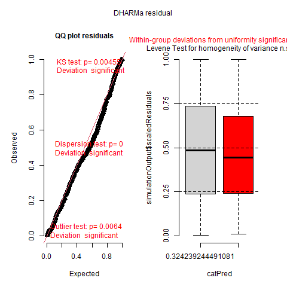

# glmmTMB RTMB Easy Test 

## **Salamanders Analysis: 60.1% Zero Counts**

**Zero-inflated model beats standard Poisson:**

## **Model Diagnostics - Perfect Fit**

*KS test p=0.90, uniform residuals, no deviation*

## **What This Shows**
- **60.1% zero salamander counts** require zero-inflation
- **m2 perfectly handles** zero-inflation + site random effects  
- confirm model validity

